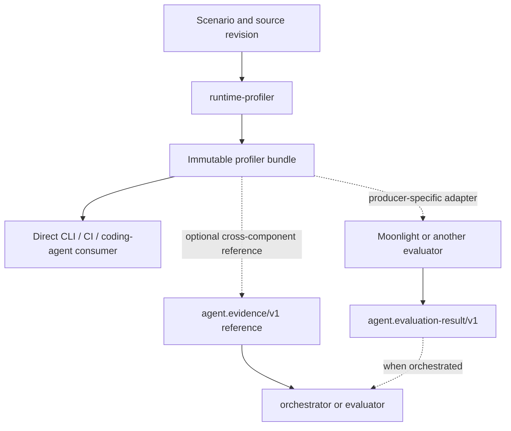

# Architecture

## Responsibility

runtime-profiler is an evidence producer. It executes an explicitly declared
workload and produces bounded, integrity-checked runtime facts. It may also
produce descriptive score and comparability evidence for strictly compatible
bundles, but it does not decide whether one implementation is preferable to
another or should ship.

The profiler bundle is the authoritative artifact and does not require an
orchestrator. The neutral `agent.evidence/v1` reference is used when evidence
crosses an independently owned component boundary. The producer-specific
evaluator adapter is separate: Moonlight may understand the profiler bundle
format, but that private producer/evaluator integration must not become the
orchestration contract.

Descriptive baseline/candidate normalization and hotspot comparability remain
profiler evidence. Project-specific thresholds, regression policy, pass/fail
language, and release verdicts belong to Moonlight or another evaluator.

## Layers

1. **Scenario parsing** accepts versioned YAML or JSON and performs semantic
   validation beyond the JSON Schema.
2. **Capture** owns lifecycle, warm-up, repetition, timeout, and raw sampling.
3. **Collectors** translate profiler-specific data into stable metric and
   hotspot contracts.
4. **Bundle creation** writes redacted artifacts and their cryptographic
   digests. `manifest.json` is written last.
5. **Landscape adapter** optionally exposes the complete immutable bundle as a
   neutral `agent.evidence/v1` reference without copying measurements into the
   shared contract.
6. **Presentation and descriptive normalization** render bounded JSON or
   Markdown and compare strictly compatible evidence without adding project
   policy or release verdicts.

The CLI is a thin adapter. `coding-tooling` may invoke the CLI through a declared
semantic capability; first-class discovery should still call the same library
or stable CLI rather than implement a second capture path.

## Evidence identity

Source identity and execution-environment identity are independent provenance
axes. Git SHA and dirty state identify the code that produced a capture; they
must not participate in `environment_fingerprint`, because source revisions are
expected to differ between a baseline and a candidate. The environment
fingerprint is derived only from normalized, non-source execution-environment
properties such as OS, architecture, kernel release, and logical CPU count.

The fingerprint input has its own version domain so future changes to which
environment properties participate can be made deliberately without coupling
them to source metadata or evaluator policy. Both `environment.json` and
`manifest.json` publish `environment_fingerprint_schema_version`. Bundles that
predate that additive field deserialize as the legacy source-inclusive
algorithm, so consumers can distinguish them from source-independent v1
fingerprints without invalidating existing artifacts.

## Immutability

A capture refuses an existing output path. Evidence is never updated in place.
Consumers may cache a bundle by `bundle_id`; any mutation is detected through
artifact SHA-256 validation.

The neutral evidence reference must be content-addressed strongly enough to
commit to the complete profiler bundle. It is a pointer to the immutable native
artifact, not a second measurement format.

## Extensibility

Collectors are additive. A scenario must name every collector it expects, and
an unavailable collector must fail during planning rather than disappear from
the evidence. Runtime-specific native artifacts remain optional sidecars while
normalized summaries stay small and stable.

Evaluator integrations are also adapters. They consume a supported profiler
bundle version and emit their own neutral evaluation result; they do not move
comparison policy into runtime-profiler.

## Non-goals

- Always-on production monitoring or alerting.
- A general observability storage backend.
- A human dashboard.
- Automated baseline/candidate release verdicts.
- Owning orchestrator run state or shared ecosystem contracts.
- LLM-generated performance measurements.
