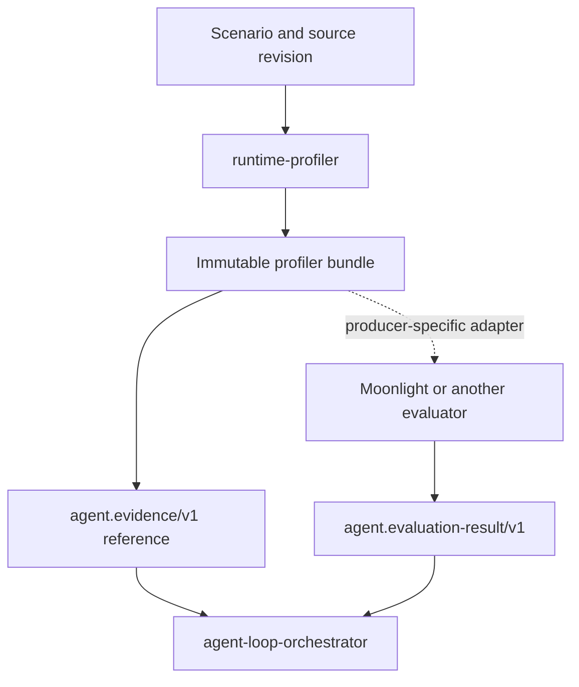

# Architecture

## Responsibility

runtime-profiler is an evidence producer. It executes an explicitly declared
workload and produces bounded, integrity-checked runtime facts. It does not
decide whether one implementation is preferable to another.

The solid path is the shared landscape boundary. The dotted path is an evaluator
adapter: Moonlight may understand the profiler bundle format, but that private
producer/evaluator integration must not become the orchestration contract.

## Layers

1. **Scenario parsing** accepts versioned YAML or JSON and performs semantic
   validation beyond the JSON Schema.
2. **Capture** owns lifecycle, warm-up, repetition, timeout, and raw sampling.
3. **Collectors** translate profiler-specific data into stable metric and
   hotspot contracts.
4. **Bundle creation** writes redacted artifacts and their cryptographic
   digests. `manifest.json` is written last.
5. **Landscape adapter** exposes the complete immutable bundle as a neutral
   `agent.evidence/v1` reference without copying measurements into the shared
   contract.
6. **Presentation** renders bounded JSON or Markdown without changing evidence.

The CLI is a thin adapter. `coding-tooling` may invoke the CLI through a declared
semantic capability; first-class discovery should still call the same library
or stable CLI rather than implement a second capture path.

## Immutability

A capture refuses an existing output path. Evidence is never updated in place.
Consumers may cache a bundle by `bundle_id`; any mutation is detected through
artifact SHA-256 validation.

The neutral evidence reference must be content-addressed strongly enough to
commit to the complete profiler bundle. It is a pointer to the immutable native
artifact, not a second measurement format.

## Extensibility

Collectors are additive. A scenario must name every collector it expects, and
an unavailable collector must fail during planning rather than disappear from
the evidence. Runtime-specific native artifacts remain optional sidecars while
normalized summaries stay small and stable.

Evaluator integrations are also adapters. They consume a supported profiler
bundle version and emit their own neutral evaluation result; they do not move
comparison policy into runtime-profiler.

## Non-goals

- Always-on production monitoring or alerting.
- A general observability storage backend.
- A human dashboard.
- Automated baseline/candidate verdicts.
- Owning orchestrator run state or shared ecosystem contracts.
- LLM-generated performance measurements.
